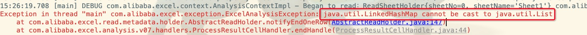

# EasyExcel


## 引入jar
```
<dependency>
    <groupId>com.alibaba</groupId>
    <artifactId>easyexcel</artifactId>
    <version>2.1.1</version>
</dependency>
```

## 简单示例

### 读取excel

***参考DEMO：*** 

<font color=red>/Library/3github/java/src/main/java/com/srs/java/javabase/easyexcel/code/EasyReadExcelDemo.java</font>


#### 遇到的问题

##### 使用EasyExcel.read()时报错



原因：继承AnalysisEventListener时，一般会定义POJO承接数据，如果想返回List<List<String>>，需要
用LinkedHashMap承接数据,然后再转为List<List<String>>.
    
### 导出excel